# Storage Management System

A web-based storage, sales, payments and debt tracking system developed using Google Apps Script, HTML, Bootstrap and Google Sheets.

## 📷 Screenshots

### 1. 🏠 Main Dashboard

The main interface provides quick navigation between users, sales, payments and metrics modules through a clean and responsive dashboard.

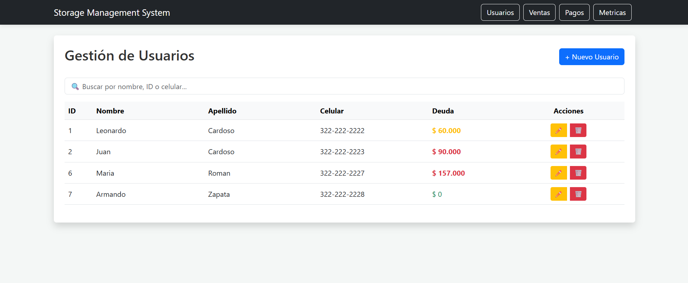

---

### 2. 👥 User Management Module

This module allows administrators to create, edit and manage users while tracking outstanding debts.

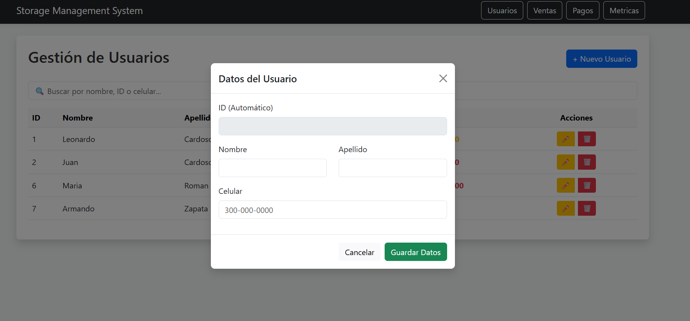


---

### 3. ✏️ Update User Information

The system allows administrators to edit user details including names, phone numbers and account information.

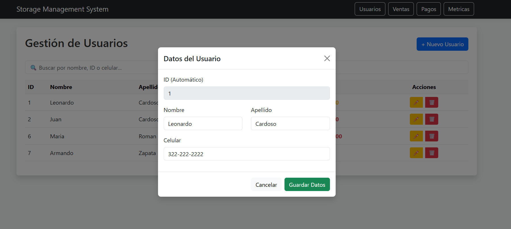

---

### 4. 🗑️ Disable Users Confirmation

Instead of permanently deleting users, the system performs soft deletion by disabling inactive accounts.

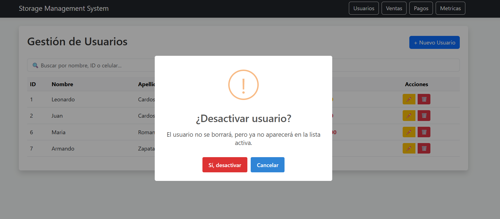

---

### 5. 💰 Sales Management Dashboard

The sales dashboard allows users to visualize, search and manage all sales records in a responsive table interface.

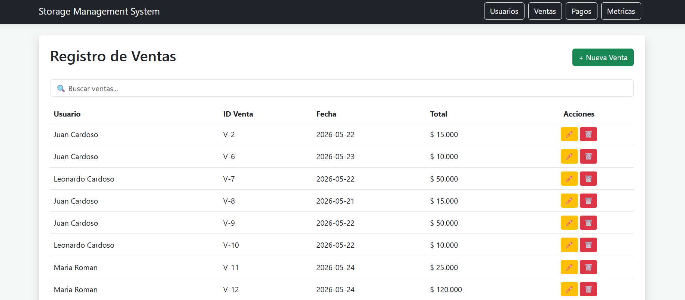

---

### 6. ➕ Create New Sale

Admin can register new sales by selecting a customer, assigning a date and entering the total sale amount.

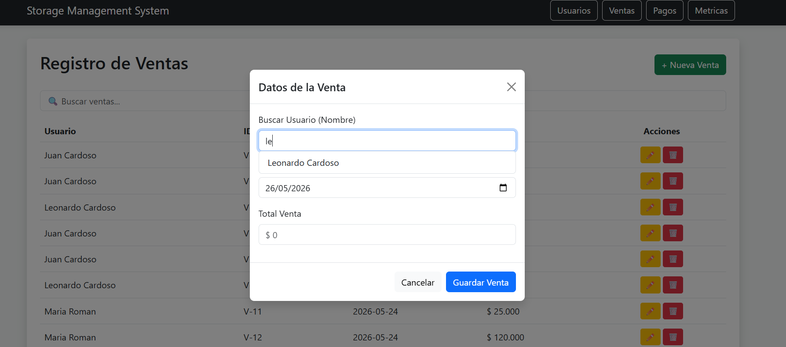

---

### 7. ✏️ Update Sales Information

Sales records can be modified using an editable modal interface connected to the Google Sheets database.

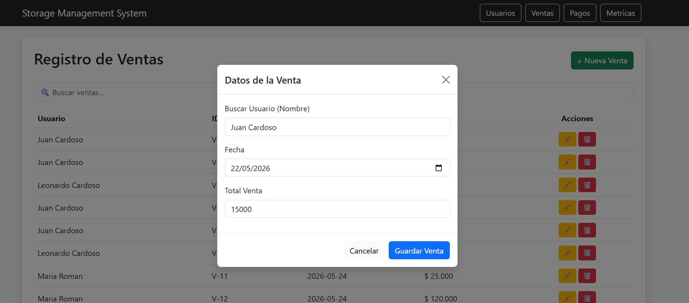

---

### 8. 🗑️ Delete Sales Confirmation

The system includes confirmation alerts before deleting sales records to prevent accidental actions.

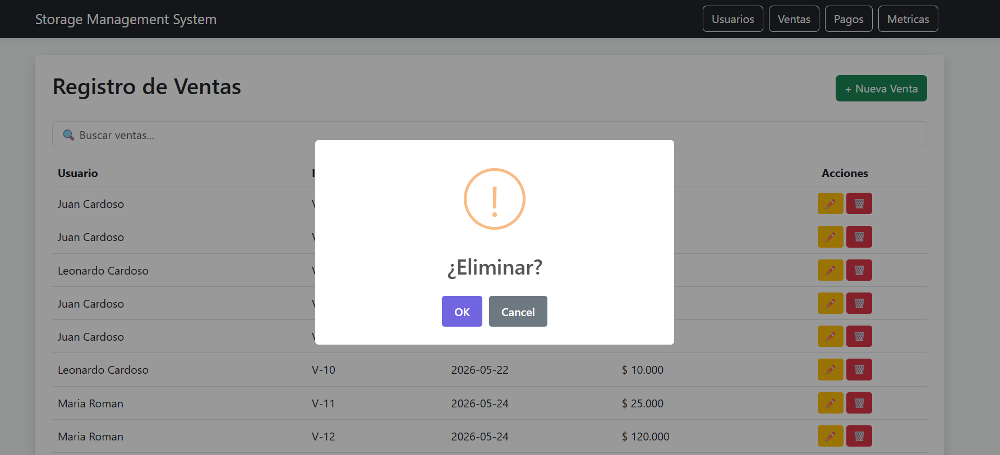

---

### 9. 💳 Payments Management Dashboard

The payments module displays all registered payments with filtering, editing and deletion functionalities.

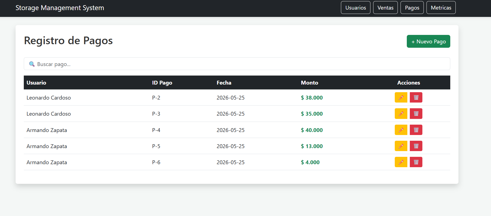

---

### 10. ➕ Create New Payment

The payment module allows debt reconciliation by selecting pending sales and registering customer payments.

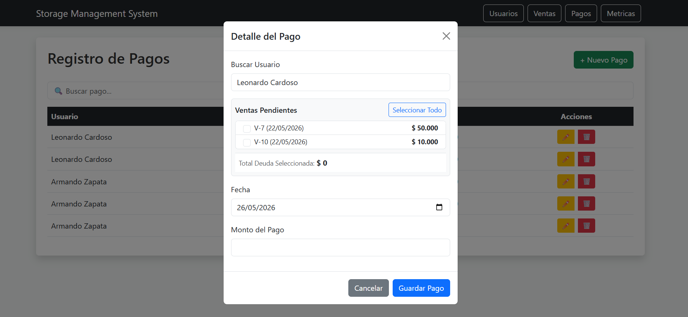

---

### 11. ✏️ Update Payment Information

Existing payments can be updated through a modal form with customer selection, payment date and amount editing.

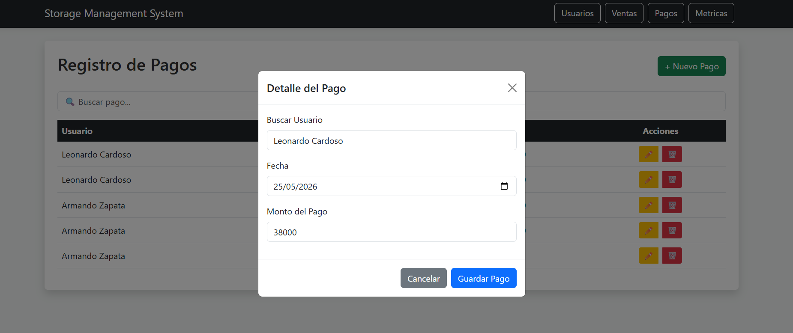

---

### 12. 🗑️ Delete Payments Confirmation

Payment records can be safely removed using confirmation dialogs integrated with SweetAlert2.

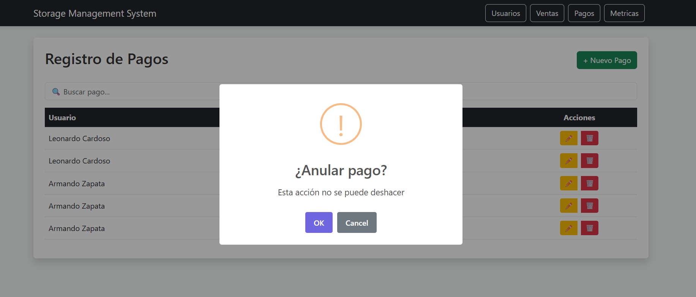

---

### 13. 📲 WhatsApp Payment Notifications

The system automatically generates WhatsApp notifications after successful payment and sale registration, allowing administrators to instantly inform customers about their payments and updated balances.

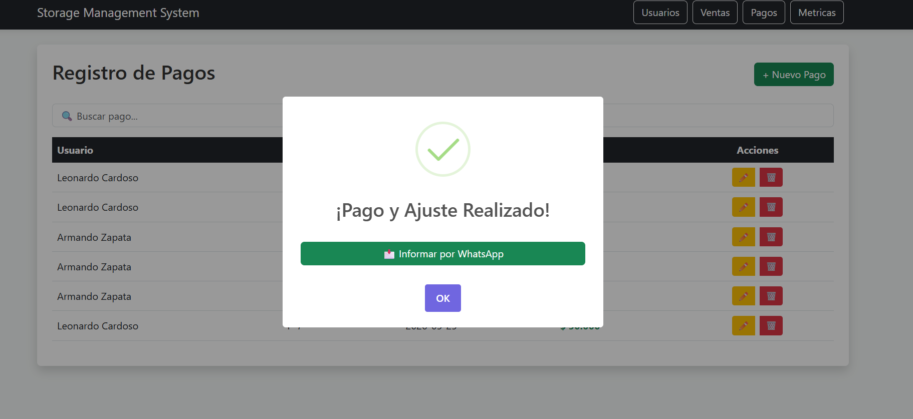

---

### 14. 💬 WhatsApp Integration

Customers receive personalized payment confirmation messages through WhatsApp Web integration, improving communication and payment tracking efficiency.

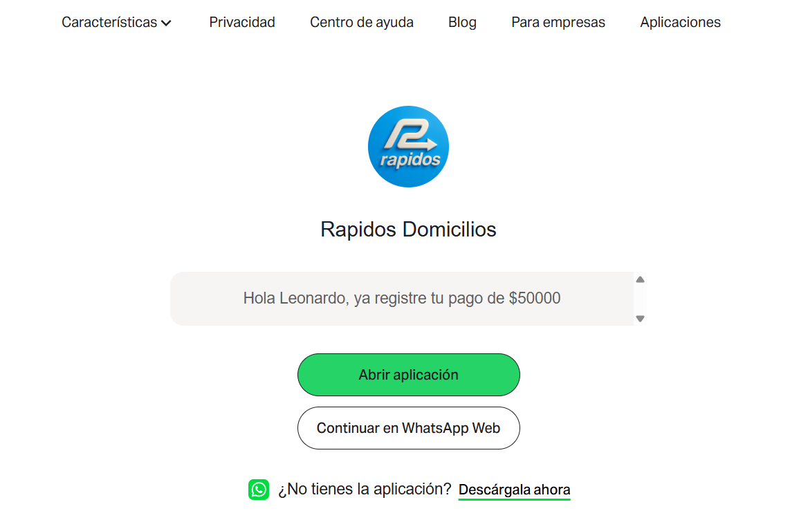
---

### 15. 📊 Metrics Dashboard

The metrics panel provides visual analytics including total sales, payments collected, pending balances and top debtors using interactive charts.

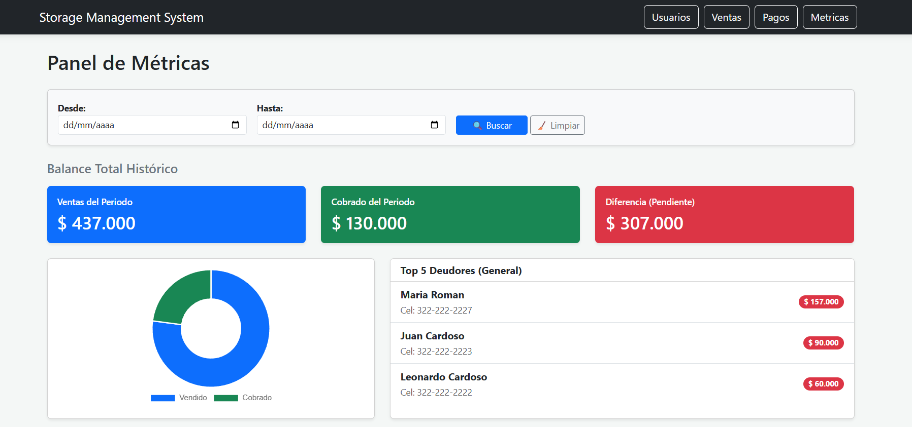


---

## 📌 Features

- User management
- Sales registration
- Payment reconciliation
- Debt tracking
- Metrics dashboard
- WhatsApp payment notifications
- Search and filtering system
- Responsive interface using Bootstrap

---

## 🛠️ Technologies Used

- Google Apps Script
- HTML5
- JavaScript
- Bootstrap 5
- SweetAlert2
- Chart.js
- Google Sheets Database

---

## 📂 Project Structure

```bash
├── Index.html
├── usuarios_view.html
├── usuarios_js.html
├── ventas_view.html
├── ventas_js.html
├── pagos_view.html
├── pagos_js.html
├── metricas_view.html
├── metricas_js.html
├── code.gs
└── Storage Management System.xlsx
```

---

## ⚙️ How to Run the Project

### 1. Create a Google Apps Script Project

Go to:

https://script.google.com

Create a new project.

---

### 2. Upload the Files

Copy the content of:

- Index.html
- usuarios_view.html
- usuarios_js.html
- ventas_view.html
- ventas_js.html
- pagos_view.html
- pagos_js.html
- metricas_view.html
- code.gs

into your Apps Script project.

---

### 3. Create Google Sheets Database

Create a new Google Spreadsheet and configure the required sheets.

Then copy the Spreadsheet ID.

---

### 4. Configure Spreadsheet ID

Inside `code.gs`, replace:

```javascript
const SPREADSHEET_ID = "YOUR_SPREADSHEET_ID";
```

with your Google Sheets ID.

---

### 5. Deploy the Application

In Google Apps Script:

1. Click **Deploy**
2. Select **New Deployment**
3. Choose **Web App**
4. Set access permissions
5. Deploy

---

## 📊 Main Modules

### 👥 User Management

- Create users
- Edit users
- Soft delete users
- Debt visualization

### 💰 Sales Management

- Register sales
- Associate sales with users
- WhatsApp sales summary

### 💳 Payment Management

- Register payments
- Reconcile pending debts
- Partial debt payments
- Payment notifications

### 📈 Metrics Dashboard

- Total sales
- Total payments
- Outstanding balance
- Top debtors
- Charts and analytics

---

## 📱 External Libraries

The project uses CDN libraries:

- Bootstrap 5
- SweetAlert2
- Chart.js

No local installation is required.

---

## 🚀 Future Improvements

- Authentication system
- Role-based access
- Export reports to PDF/Excel
- Email notifications
- Inventory management
- Cloud database migration

---

## 👨‍💻 Author

Developed by Leonardo Cardoso Rodriguez.
